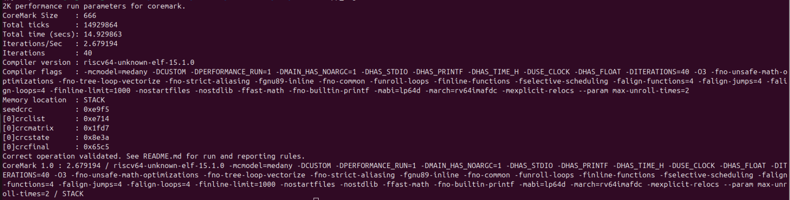
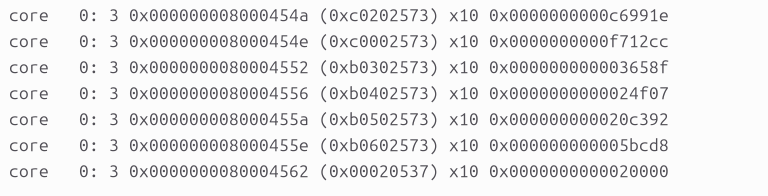

## CoreMark Results

### App_log 



### Rtl.dump
 


 ## PERFORMANCE COUNTERS
```
Retired Instructions: 0x0000000000c6991e
Cycles: 0x0000000000f712cc
Branch Mispredictions: 0x000000000003658f
Number of Jumps: 0x0000000000024f07
Number of Branches: 0x0000000000020c392
Number of MUL/DIV Instructions: 0x000000000005bcd8
```