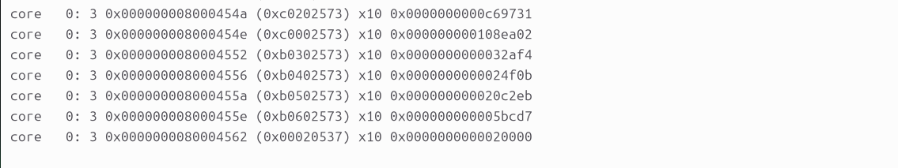

## CoreMark Results

### App_log 
 


### Rtl.dump



## PERFORMANCE COUNTERS
```
Retired Instructions: 0x0000000000c69731
Cycles: 0x000000000108ea02
Branch Mispredictions: 0x0000000000032af4
Number of Jumps: 0x0000000000024f0b
Number of Branches: 0x0000000000020c2eb
Number of MUL/DIV Instructions: 0x000000000005bcd7
```

